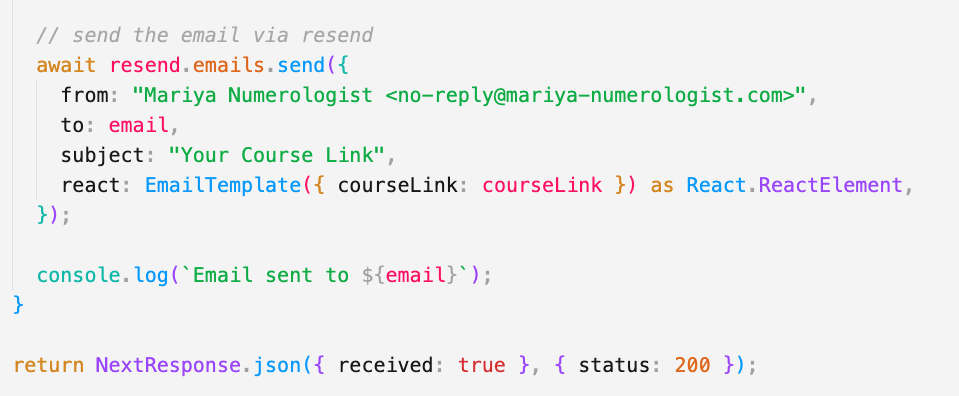
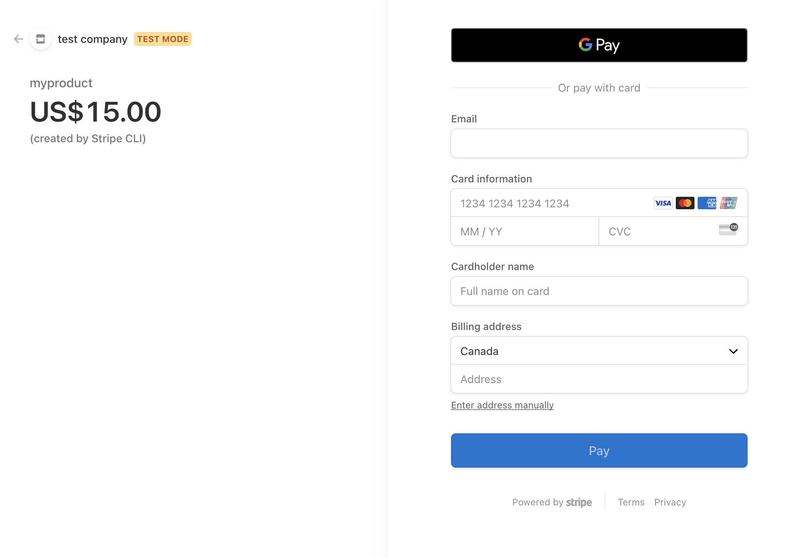
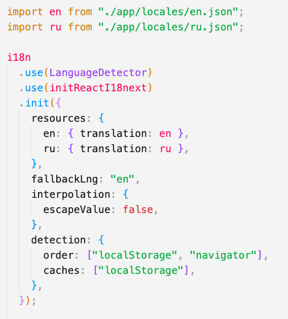

# Astrology Course Website

## 📌 Overview  
This is a fully responsive astrology course website developed by me.  
The website serves as a platform for **Mariya Kovalenko** to showcase and sell her online intensive course.  
It provides structured content, an intuitive user experience, and seamless navigation to guide users through the course offerings.

---

## 🚀 Features

- 🌍 **Multi-Language Support** — English & Russian (currently disabled as requested by client, but functionality is still present in code)
- 📱 **Fully Responsive Design** — Optimized for all screen sizes
- 🎨 **Tailwind Styling** — Efficient and maintainable design
- 📂 **Mobile-Friendly Dropdown Menu** — Collapsible nav with language toggle
- 💰 **Stripe Checkout Page** — Secure payment for course access

---

## 🛠 Tech Stack

- **Framework:** Next.js 14
- **Styling:** Tailwind CSS
- **Payment:** Stripe
- **Emails:** [Resend API](https://resend.com/) — transactional emails after successful checkout
- **State Management:** `useState`, `useEffect`
- **i18n:** `react-i18next` (English & Russian)
- **Images:** Next.js Image Component
- **Deployment:** Vercel

---

## ✉️ Automated Emails with Resend

Upon successful Stripe payment, the site sends a **custom transactional email** using the **[Resend API](https://resend.com/)**. This email includes a personalized course access link for the customer, built with:

- ✅ A clean React-based email template  
- ✅ Sent from a custom verified domain  
- ✅ Managed securely through a webhook and server route (`/api/webhook`)

---

## 💰 Seamless Checkout with Stripe

Users can purchase the course securely using **Stripe Checkout**, which handles payments, taxes, and customer info:

- ✅ Hosted Stripe Checkout page  
- ✅ Dynamic pricing and confirmation  
- ✅ Webhook integration for post-purchase automation  
- ✅ Redirects to a clean thank-you page

---

## 🌍 Multi-Language Support (i18n)

The site supports **English and Russian**, providing a localized experience using `react-i18next`:

- ✅ Language toggle in navigation  
- ✅ Auto-detection of browser language  
- ✅ Translations for all core UI content  
- ✅ Organized `locales/` directory for easy content management

---

## 🎯 Why I Built This

This project allowed me to:

- ✔ Improve my Next.js & Tailwind CSS skills  
- ✔ Work with multi-language support in a real-world application  
- ✔ Learn more about UX/UI for course-based websites

---

## 🌐 Live Demo & Deployment

- 🔗 **Live URL:** [mariya-numerologist.com](https://www.mariya-numerologist.com/)
- 📦 **Hosted on:** Vercel

---

